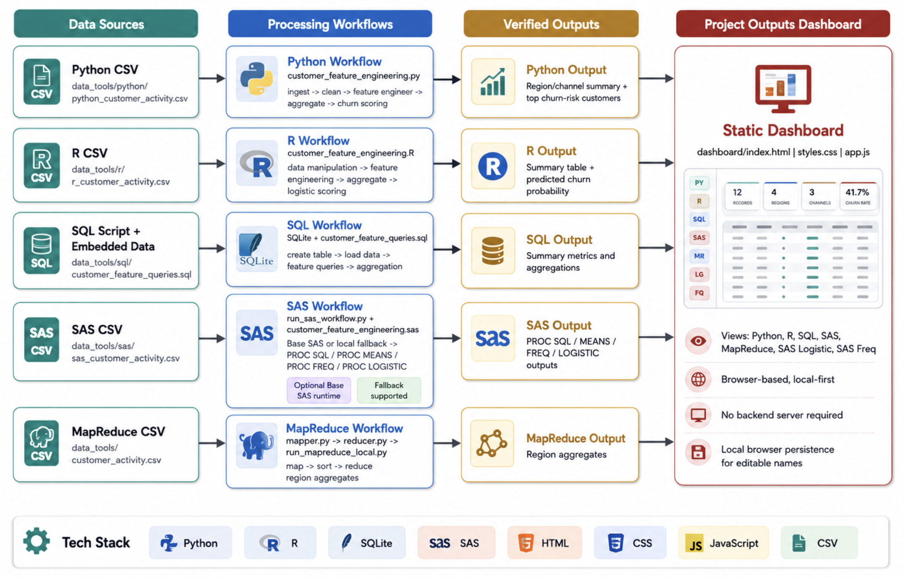
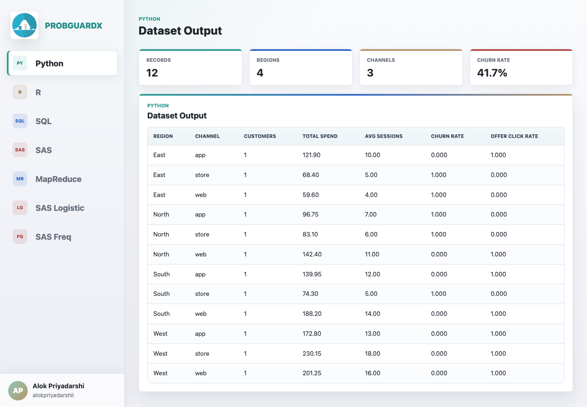
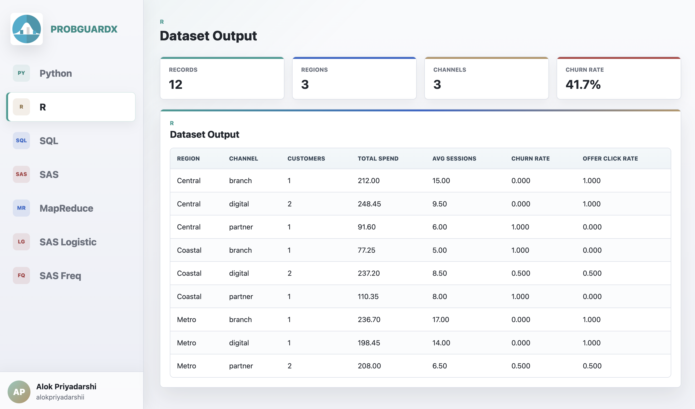

# ProbGuardX

**ProbGuardX** is a machine learning, statistics, and data workflow project focused on probabilistic modeling, supervised and unsupervised learning, Bayesian methods, Gaussian processes, graphical models, decision trees, random forests, gradient boosting, deep learning, reinforcement learning, text mining, SQL analytics, MapReduce style aggregation, and SAS style analytical reporting.

The project also includes a static **Project Outputs Dashboard** for viewing verified outputs from Python, R, SQL, SAS, MapReduce, SAS Logistic, and SAS Frequency workflows. The dashboard supports clickable output sections, separate datasets for Python/R/SQL/SAS, editable dashboard names, and local browser persistence.

---

## Features

* Bayesian models and probabilistic machine learning examples
* Gaussian process and graphical model coverage
* Supervised and unsupervised machine learning workflows
* Decision trees, random forest, and gradient boosting coverage
* Deep learning, reinforcement learning, transfer learning, and active learning coverage
* NLP and text mining algorithm coverage
* Python data manipulation and feature engineering workflow
* R data manipulation, aggregation, and logistic modeling workflow
* SQL data manipulation, feature engineering, and aggregation workflow
* SAS PROC SQL, PROC MEANS, PROC FREQ, and PROC LOGISTIC style workflow
* Local SAS-equivalent fallback when Base SAS is not installed
* MapReduce-style mapper/reducer aggregation example
* Separate datasets for Python, R, SQL, and SAS outputs
* Static dashboard for viewing all project outputs
* Clickable dashboard navigation for Python, R, SQL, SAS, MapReduce, SAS Logistic, and SAS Freq
* Editable dashboard brand and profile names with browser persistence
* Local-first execution with no backend server required for the dashboard

---

## Preview







---

## Tech Stack

| Category             | Technology                                |
| -------------------- | ----------------------------------------- |
| Programming Language | Python                                    |
| Data Analysis        | Python Standard Library, R, SQL, SAS      |
| SQL Runtime          | SQLite                                    |
| SAS Workflow         | Base SAS Program, Local SAS Fallback      |
| MapReduce            | Python Mapper and Reducer Scripts         |
| Dashboard Frontend   | HTML, CSS, JavaScript                     |
| Data Format          | CSV                                       |
| ML Methods           | Logistic Scoring, Feature Engineering     |
| Visualization        | Static Output Dashboard                   |
| Package Management   | pip, requirements.txt                     |

---

## Project Structure

```text
ProbGuardX/
├── .github/
│   ├── scripts/
│   └── workflows/
├── dashboard/
│   ├── assets/
│   ├── app.js
│   ├── index.html
│   └── styles.css
├── data_tools/
│   ├── mapreduce/
│   ├── python/
│   ├── r/
│   ├── sas/
│   ├── sql/
│   └── customer_activity.csv
├── deprecated/
│   ├── gan/
│   ├── notebooks/
│   ├── scripts/
│   └── vae/
├── images/
│   ├── preview-1.png
│   ├── preview-2.png
│   └── preview-3.png
├── internal/
│   ├── book1/
│   ├── book2/
│   ├── contributors/
│   └── fig_height/
├── notebooks/
│   ├── book1/
│   ├── book2/
│   ├── figures/
│   ├── misc/
│   └── tutorials/
├── scripts/
├── tests/
│   ├── icons/
│   ├── __init__.py
│   ├── test_imports.py
│   └── test_notebooks.py
├── tikz/
├── .gitattributes
├── .gitignore
├── .pre-commit-config.yaml
├── CITATION.cff
├── LICENSE
├── README.md
├── __init__.py
├── external_links.csv
├── index.html
├── pyproject.toml
├── pytest.ini
├── requirements-bash.txt
├── requirements-dev.txt
├── requirements.txt
├── scratchpad.ipynb
└── vercel.json
```

---

## Getting Started

### Prerequisites

* Python 3.x
* `pip`
* SQLite command line tool
* R and `Rscript`
* Optional Base SAS runtime
* A modern browser for the dashboard

### Clone the Repository

```bash
git clone https://github.com/alokpriyadarshii/ProbGuardX.git
cd ProbGuardX
```

### Create a Virtual Environment

```bash
python3 -m venv .venv
source .venv/bin/activate
```

For Windows:

```bash
python -m venv .venv
.venv\Scripts\activate
```

### Install Python Dependencies

```bash
pip install --upgrade pip
pip install -r requirements.txt
```

### Open the Dashboard

Open the dashboard directly in your browser:

```text
dashboard/index.html
```

Or serve it locally:

```bash
cd dashboard
python3 -m http.server 8080
```

Open the dashboard in your browser:

```text
http://localhost:8080
```

### Deploy on Vercel

The repository includes a root `index.html` and `vercel.json` so Vercel can serve the dashboard as a static site from the production domain. The Vercel config skips dependency installation and copies the dashboard into `public/` during deployment. After deploying, open the production domain and it will forward to:

```text
/dashboard/
```

If a generated Vercel deployment URL shows **Authentication Required**, update the project's Deployment Protection settings in Vercel. Standard Protection protects generated deployment URLs while production domains remain publicly accessible.

---

## Quick Start Example

Run the Python feature engineering and churn scoring workflow:

```bash
python3 data_tools/python/customer_feature_engineering.py
```

Expected output includes:

```text
Aggregated customer features by region/channel
region  channel  customers  total_spend  avg_sessions  churn_rate  offer_click_rate

Top churn-risk customers
customer_id  region  channel  churned  predicted_churn_probability
```

---

## Python Workflow

The Python workflow demonstrates CSV ingestion, cleaning, date handling, aggregation, feature creation, and supervised churn scoring.

```bash
python3 data_tools/python/customer_feature_engineering.py
```

The default Python dataset is:

```text
data_tools/python/python_customer_activity.csv
```

Use a custom dataset:

```bash
python3 data_tools/python/customer_feature_engineering.py --data path/to/customer_activity.csv
```

---

## R Workflow

The R workflow demonstrates data manipulation, date handling, aggregation, risk segmentation, and logistic regression scoring.

```bash
Rscript data_tools/r/customer_feature_engineering.R
```

The default R dataset is:

```text
data_tools/r/r_customer_activity.csv
```

Use a custom dataset:

```bash
Rscript data_tools/r/customer_feature_engineering.R path/to/customer_activity.csv
```

---

## SQL Workflow

The SQL workflow demonstrates table creation, embedded data loading, feature engineering, window functions, grouping, and aggregation.

```bash
sqlite3 :memory: ".read data_tools/sql/customer_feature_queries.sql"
```

The SQL dataset is embedded in:

```text
data_tools/sql/customer_feature_queries.sql
```

Expected output includes region and channel summaries with customer counts, total spend, average sessions, churn rate, offer click rate, and average spend per session.

---

## SAS Workflow

The SAS workflow includes a Base SAS program and a Python launcher. If Base SAS is installed, the launcher executes the SAS program. If SAS is unavailable, it runs a local SAS-equivalent fallback with matching output categories.

```bash
./data_tools/sas/run_sas_workflow.py
```

The default SAS dataset is:

```text
data_tools/sas/sas_customer_activity.csv
```

The SAS program is:

```text
data_tools/sas/customer_feature_engineering.sas
```

### SAS Output Sections

* PROC SQL style region/channel summary
* PROC MEANS style descriptive statistics
* PROC FREQ style crosstab outputs
* PROC LOGISTIC style churn score output

Force the local fallback:

```bash
./data_tools/sas/run_sas_workflow.py --force-fallback
```

---

## MapReduce Workflow

The MapReduce workflow demonstrates mapper/reducer style aggregation over customer activity data.

```bash
python3 data_tools/mapreduce/run_mapreduce_local.py
```

Expected output includes:

```text
region  customers  total_spend  avg_sessions  churn_rate
```

---

## Project Outputs Dashboard

The repository includes a static dashboard inside `dashboard/`.

### Dashboard Sections

* Python dataset output
* R dataset output
* SQL dataset output
* SAS dataset output
* MapReduce region aggregate output
* SAS Logistic churn score output
* SAS Frequency output
* Editable dashboard name
* Editable profile name and profile handle

### Dashboard Behavior

* Click `Python` to show only the Python dataset output
* Click `R` to show only the R dataset output
* Click `SQL` to show only the SQL dataset output
* Click `SAS` to show only the SAS dataset output
* Click `MapReduce` to show only the MapReduce aggregate output
* Click `SAS Logistic` to show only churn score output
* Click `SAS Freq` to show frequency tables

> Note: The dashboard uses local static data from `dashboard/app.js`. The displayed values are aligned with the local project datasets and command-line workflow outputs.

---

## Testing

Run the main local workflow checks:

```bash
python3 data_tools/python/customer_feature_engineering.py
Rscript data_tools/r/customer_feature_engineering.R
sqlite3 :memory: ".read data_tools/sql/customer_feature_queries.sql"
./data_tools/sas/run_sas_workflow.py
python3 data_tools/mapreduce/run_mapreduce_local.py
```

Check dashboard JavaScript syntax:

```bash
node --check dashboard/app.js
```

---

## Development Commands

```bash
# Run Python output workflow
python3 data_tools/python/customer_feature_engineering.py

# Run R output workflow
Rscript data_tools/r/customer_feature_engineering.R

# Run SQL output workflow
sqlite3 :memory: ".read data_tools/sql/customer_feature_queries.sql"

# Run SAS workflow or fallback
./data_tools/sas/run_sas_workflow.py

# Run MapReduce workflow
python3 data_tools/mapreduce/run_mapreduce_local.py

# Serve dashboard locally
cd dashboard
python3 -m http.server 8080
```

---

## Data Sources

| Runtime | Dataset                                           |
| ------- | ------------------------------------------------- |
| Python  | `data_tools/python/python_customer_activity.csv`  |
| R       | `data_tools/r/r_customer_activity.csv`            |
| SQL     | `data_tools/sql/customer_feature_queries.sql`     |
| SAS     | `data_tools/sas/sas_customer_activity.csv`        |
| MapReduce | `data_tools/customer_activity.csv`              |

---

## License

This project includes `LICENSE.txt`.

---

## Author

**Alok Priyadarshi**

GitHub: [alokpriyadarshii](https://github.com/alokpriyadarshii)

Email: `alokpriyadarshi618@gmail.com`
